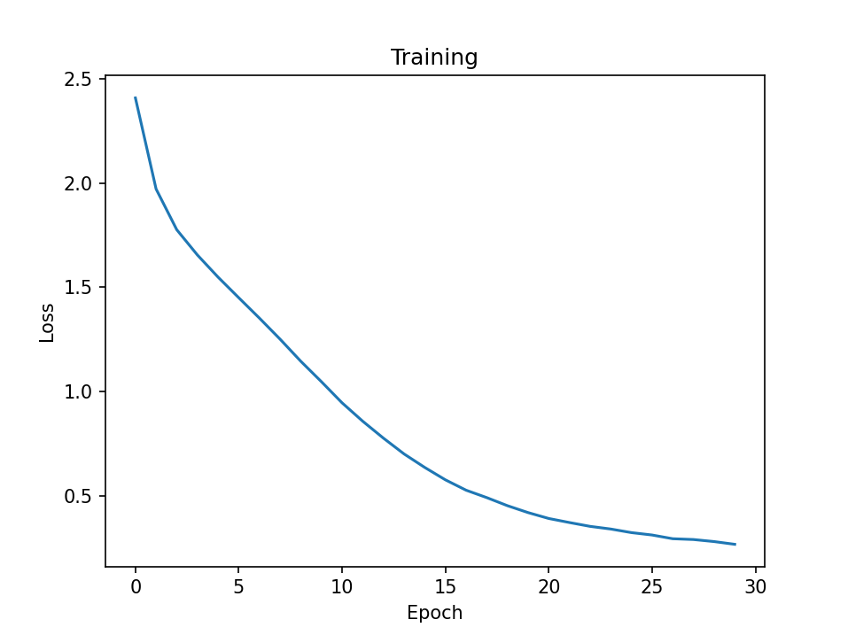
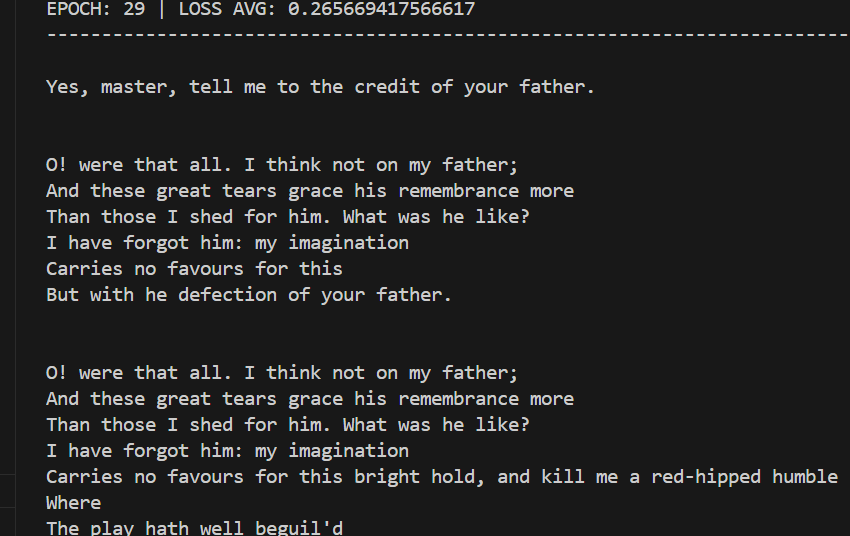

# Text generating transformer
This is a decoder-only transformer with simplest character-level tokenization. Script has model training and text generation examples. 
# How to use:
## 1) Install dependences:
```
pip install numpy torch torchinfo matplotlib
```
## 2) Configure:
```
# main.py

# configure model

tgt = MyTGT(data, 
		path = 'model.pt',   # path to the model, to train new model you have to delete the previous one
		context_size = 128,  # context size, bigger context usually provides more coherent generation
		batch_size = 64,     # batch size, higher values provide faster training and lower quality and vice versa
		d_model = 512,       # model depth, higher values provide slower training and higher quality and vice versa
		n_heads = 4,         # ibid
		n_layers = 3,        # ibid
		d_ffn = 512,         # ibid
		lr = 1e-4)           # learning rate, higher values provide fast but worse generalization

# configure training

# epochs, higher value means longer training time and usually better results
tgt.train(epochs = 30, plot=True, verbose = 2, print_every = 128)

# configure generation

# place any text in seed to generate next 'size' symbols, ensure that seed is smaller than context size
text = tgt.generate(seed = 'Yes, master, tell me ', size=128, temperature=1.1)
```
## 3) Run:
```
python main.py
```
## 4) Training process:

## 5) Results:

